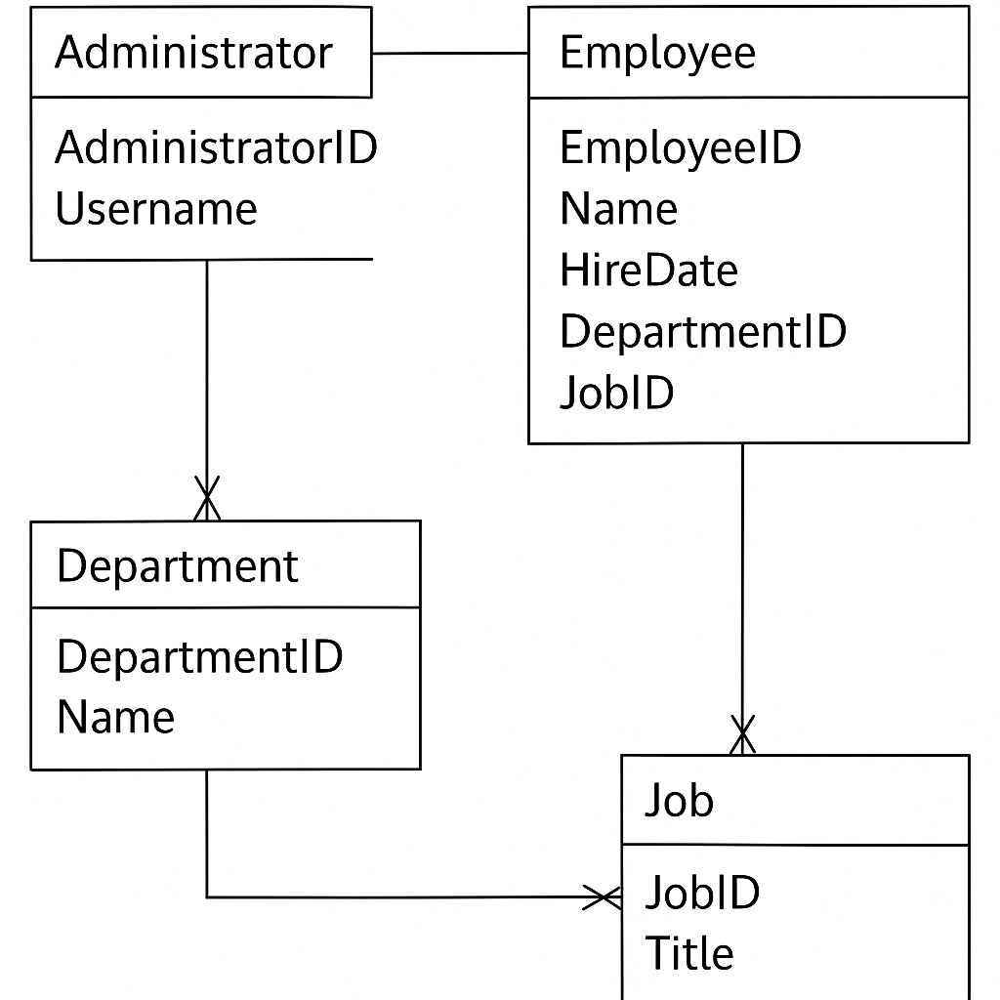

## 计算机毕业设计Python交通拥堵预测 交通流量预测 智慧城市交通大数据 交通客流量分析(源码+LW文档+PPT+讲解视频) 机器学习 大数据毕业设计 数据仓库 大数据毕业设计 文本分类 LSTM情感分析 大数据毕业设计 知识图谱 大数据毕业设计 预测系统 实时计算 离线计算 数据仓库 人工智能 神经网络

## 要求
### 源码有偿！一套(论文 PPT 源码+sql脚本+教程)

### 
### 加好友前帮忙start一下，并备注github有偿纯Py交通
### 我的QQ号是3575354124 或者798059319或者 1679232425或者微信:bysj1698

# 

### 加qq好友说明（被部分 网友整得心力交瘁）：
    1.加好友务必按照格式备注
    2.避免浪费各自的时间！
    3.当“客服”不容易，repo 主是体面人，不爆粗，性格好，文明人。

## 演示视频

https://www.bilibili.com/video/BV1HxJVzrEvk/?spm_id_from=333.1387.homepage.video_card.click

